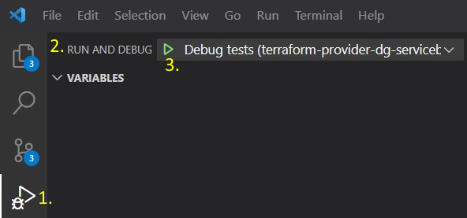

# Testing
We run the test on the [DG-PROD-Chabis-Messaging-Testing](https://portal.azure.com/#@migros.onmicrosoft.com/resource/subscriptions/1f528d4c-510c-40ed-b8e2-3865dd80f12c/resourceGroups/Messaging-Prod/providers/Microsoft.ServiceBus/namespaces/DG-PROD-Chabis-Messaging-Testing/overview) Servicebus instance. 

For the tests to success make sure the topic `bundle-1` with an `test-queue` subscriptions and the queue `test-queue` exists.

## Run Tests Locally
To run the tests locally, execute the following commands from the repository root:

```shell
export DG_SERVICEBUS_CLIENTSECRET="<Get 'DG-Messaging-Mgmt Service Principal' from RCM>"
make testacc
```

## Debug test
To debug a test, first replace the value of `DG_SERVICEBUS_CLIENTSECRET` in the file [.vscode/private.env](/.vscode/private.env), then follow these steps.

1. Select the name of the test function.
2. In the 'Debug and run' tab, choose the 'Debug tests' configuration.
3. Press the 'Run' icon.

