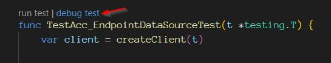

# Debugging Integration Tests in VSCode

## Goal

The goal of this guide is to explain how to debug integration tests in Visual Studio Code.

## Step-by-Step Instructions

1. Open the test file you want to debug.
2. Set breakpoints in the test code where you want to pause the execution.
3. Select the entire name of the test you wish to debug.
4. Ensure that the correct debug configuration is selected, then either click the play button or press F5 on the keyboard.

   

5. The test execution will pause at the breakpoints, allowing you to inspect variables and step through the code.
